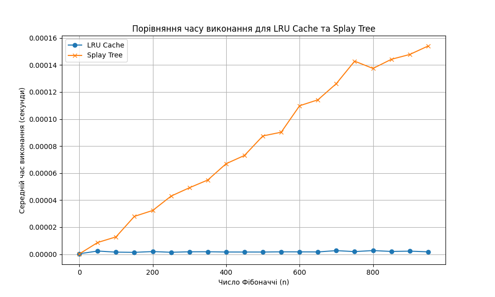

# goit-algo2-hw-07

Homework 7. Design And Analysis of Algorithms at GoIT Neoversity

# Performance Comparison: LRU Cache vs. Splay Tree for Fibonacci Computation

## Overview
This document provides an analysis of the performance comparison between two approaches for computing Fibonacci numbers:
1. **LRU Cache** – Uses Python's `@lru_cache` decorator to cache previously computed Fibonacci numbers.
2. **Splay Tree** – Uses a self-adjusting binary search tree (Splay Tree) to store and retrieve computed Fibonacci values.

The comparison evaluates the execution time for computing Fibonacci numbers at different values of `n` ranging from **0 to 950** in increments of **50**.

## Results Summary

| n   | LRU Cache Time (s) | Splay Tree Time (s) |
|------|--------------------|---------------------|
| 0    | 0.00000033        | 0.00000020         |
| 50   | 0.00000235        | 0.00000867         |
| 100  | 0.00000153        | 0.00001283         |
| 150  | 0.00000138        | 0.00002798         |
| 200  | 0.00000197        | 0.00003238         |
| 250  | 0.00000143        | 0.00004301         |
| 300  | 0.00000178        | 0.00004919         |
| 350  | 0.00000183        | 0.00005492         |
| 400  | 0.00000162        | 0.00006698         |
| 450  | 0.00000161        | 0.00007310         |
| 500  | 0.00000160        | 0.00008752         |
| 550  | 0.00000176        | 0.00009028         |
| 600  | 0.00000174        | 0.00010985         |
| 650  | 0.00000168        | 0.00011426         |
| 700  | 0.00000266        | 0.00012621         |
| 750  | 0.00000192        | 0.00014285         |
| 800  | 0.00000271        | 0.00013748         |
| 850  | 0.00000203        | 0.00014422         |
| 900  | 0.00000226        | 0.00014780         |
| 950  | 0.00000177        | 0.00015405         |

## Graphical Representation

Below is a graph showing the execution time of both approaches across different Fibonacci numbers:

## Analysis & Conclusion

### 1. **LRU Cache Performance**
- The LRU Cache approach consistently shows **much lower execution time** compared to the Splay Tree.
- Execution time remains **almost constant** for all values of `n`, indicating **O(1) retrieval** from the cache.
- The efficiency of LRU Cache makes it highly suitable for computing Fibonacci numbers, as it avoids redundant calculations.

### 2. **Splay Tree Performance**
- The execution time of the Splay Tree approach **increases linearly** with `n`, suggesting an **O(log n)** complexity.
- Despite being an optimized binary search tree, the additional rotations in the tree structure make it **significantly slower** than LRU Cache.
- For small values of `n`, the difference is less noticeable, but for larger values, **Splay Tree becomes significantly slower**.

### 3. **Overall Comparison**
- **For large values of `n`, LRU Cache is clearly superior**, as it retrieves cached values in **constant time**.
- **Splay Tree is not well-suited for Fibonacci computation**, as it incurs additional overhead in maintaining tree balance.

---
